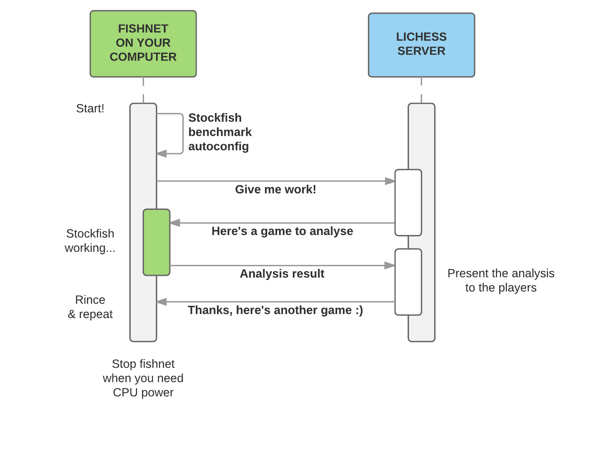

# fairyfishnet

[](https://pypi.org/project/fairyfishnet/)

Distributed [Fairy-Stockfish](https://github.com/ianfab/Fairy-Stockfish) analysis for [pychess.org](https://www.pychess.org/).

fairyfishnet requires Python 3.8 or newer.

## Installation

1. Request a personal fairyfishnet key on the [pychess Discord server](https://discord.gg/aPs8RKr).
2. Install [uv](https://docs.astral.sh/uv/getting-started/installation/).
3. Install the worker as an isolated command-line tool:

   ```console
   uv tool install --with pip fairyfishnet
   ```

4. Start the worker and follow the configuration prompts:

   ```console
   fairyfishnet --auto-update
   ```

To upgrade manually:

```console
uv tool upgrade fairyfishnet
```

The extra `pip` package keeps the worker's existing `--auto-update` behavior available inside the isolated uv tool environment.

### systemd

Generate a service file after configuring the worker:

```console
fairyfishnet systemd
```

The command prints a service definition that can be reviewed and installed under `/etc/systemd/system/`.

### Docker

Build the image. The Dockerfile installs the latest released `fairyfishnet` package from PyPI; it does not install the current checkout:

```console
docker build -t fairyfishnet .
docker run --rm fairyfishnet --key MY_API_KEY --auto-update
```

## Fairy-Stockfish

fairyfishnet uses the pychess-variants build of [Fairy-Stockfish](https://github.com/ianfab/Fairy-Stockfish).

A suitable precompiled engine is downloaded automatically. To use a locally built engine, run `./build-stockfish.sh` and pass its path with `--stockfish-command`.

Engine lifecycle, UCI, dynamic variant, and cache invariants are documented in [ENGINES.md](ENGINES.md).

## Development

The repository uses a `src/` package layout and keeps tests under `tests/`.

Create the locked development environment using the oldest supported Python:

```console
uv sync --locked --python 3.8
```

Run the fast tests and quality checks:

```console
uv run pytest -m "not engine"
uv run ruff check .
uv run ruff format --check .
uv run pyright
uv lock --check --python 3.8
uv build
```

The engine integration tests download or launch Fairy-Stockfish:

```console
uv run pytest -m engine
```

Apply formatting with:

```console
uv run ruff format .
```

Whenever project or development dependencies change, refresh and commit the lockfile:

```console
uv lock
```

### Repository layout

```text
src/fairyfishnet/       application package and CLI entry point
tests/                  unit and engine integration tests
scripts/                release and maintenance helpers
doc/                    fishnet protocol documentation
pyproject.toml          package metadata and tool configuration
ENGINES.md              engine-specific contributor and agent guidance
```

Tests marked `engine` download or launch Fairy-Stockfish and are therefore slower and require network access on a clean checkout.

## Protocol

See [doc/protocol.md](doc/protocol.md) for the worker/server protocol.



## Releasing

Set `UV_PUBLISH_TOKEN`, then run:

```console
uv run python scripts/release.py
```

The release helper runs tests, Ruff, Pyright, builds distributions, verifies a clean Git tree, creates the version tag, pushes it, and publishes with uv.

## License

fairyfishnet is licensed under GPL-3.0-or-later. See [LICENSE.txt](LICENSE.txt).
